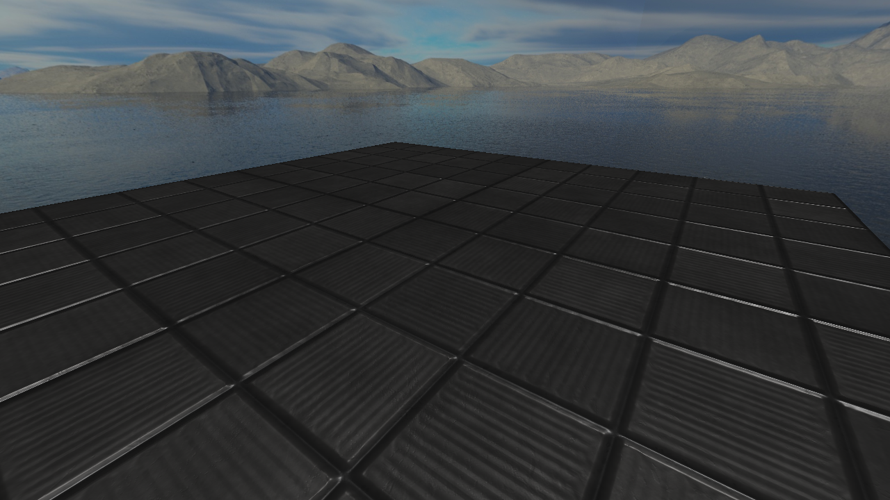

# Easel Demo
This demo shows the new PBR capabilities of Easel, as well as showing how to use both the engine, and the standalone Easel.Graphics, which Easel itself uses.

## What's the difference between Easel and Easel.Graphics?
Easel is a game engine. It provides many features such as input management, audio, and physics. However, some people may not want all these features, and just want the rendering engine. As such, Easel is written on top of `Easel.Graphics`, the now standalone graphics rendering engine.

`Easel.Graphics` provides enough of an abstraction to make rendering easy, but not so much that it is a game engine. It is still down to you to write the game loop, scene management, entities, etc.

This demo provides a sample of how to use both, as both samples produce the exact same result.

* [EaselDemo.Engine](EaselDemo.Engine) contains this demo written with Easel directly.
* [EaselDemo.Graphics](EaselDemo.Graphics) contains this demo with a basic render loop, running with Easel.Graphics.